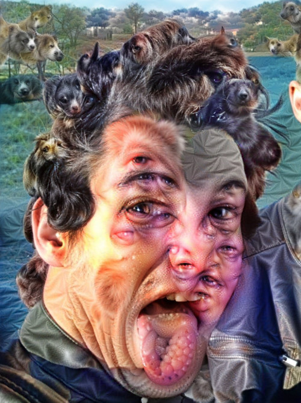
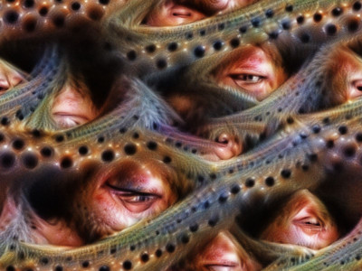
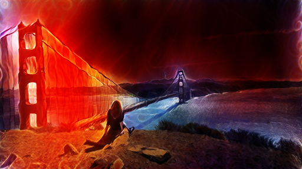

torchelie.recipes
=================

.. automodule:: torchelie.recipes

.. autoclass:: torchelie.recipes.recipebase.Recipe
   :members:
   :inherited-members:

.. autofunction:: torchelie.recipes.TrainAndCall

.. autofunction:: torchelie.recipes.TrainAndTest

.. autofunction:: torchelie.recipes.Classification

.. autofunction:: torchelie.recipes.CrossEntropyClassification

.. autofunction:: torchelie.recipes.gan.GANRecipe

Model Training
~~~~~~~~~~~~~~

.. autofunction:: torchelie.recipes.trainandtest.TrainAndTest

.. autofunction:: torchelie.recipes.classification.Classification

.. autofunction:: torchelie.recipes.classification.CrossEntropyClassification

Deep Dream
~~~~~~~~~~

.. automodule:: torchelie.recipes.deepdream

.. autoclass:: torchelie.recipes.deepdream.DeepDream
   :members:
   :special-members: __call__

Feature visualization
~~~~~~~~~~~~~~~~~~~~~

.. automodule:: torchelie.recipes.feature_vis

.. autoclass:: torchelie.recipes.feature_vis.FeatureVis
   :members:
   :special-members: __call__

Neural Style
~~~~~~~~~~~~

.. automodule:: torchelie.recipes.neural_style

.. autoclass:: torchelie.recipes.neural_style.NeuralStyle
   :members:
   :special-members: __call__

Deep Image Prior
~~~~~~~~~~~~~~~~

.. automodule:: torchelie.recipes.image_prior
